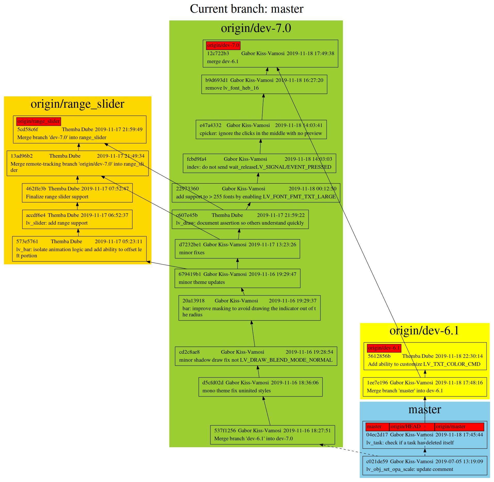

# Git graph

A tool to generate a graph from the history of git repository, with branches, tags, cherry-picks, etc.
Support some parameters for git-log.

## Requirements

* Python3
* Graphviz

## Usage

* Simple using:

```shell
git-graph.py
```

* Show branches and tags, limit 100 commits:

```shell
git-graph.py --all -n 100
```

* Show commits for single file:

```shell
.git-graph.py --all <file>
```

## Parameters

### For git commit

* --author_time: Show author time instead of commit time.
* --author_name: Show author name instead of committer name.
* --branch BRANCH: Show commits in these branch(es).
* Any unknown arguments: Pass to `git-log`.

### For graphviz

* --strict: Strict graph.
* -o, --output: Output file path. If not set, output to temporary directory, and open it with default application.
* -t, --type: Output file type. Default svg. Support all formats that graphviz support.
* --dot-args: Extra arguments pass to `dot`.


## Graph example

```shell
git-graph.py --all -n 20 -t png
```



> `Dotted line` mean there are other commits between them.
